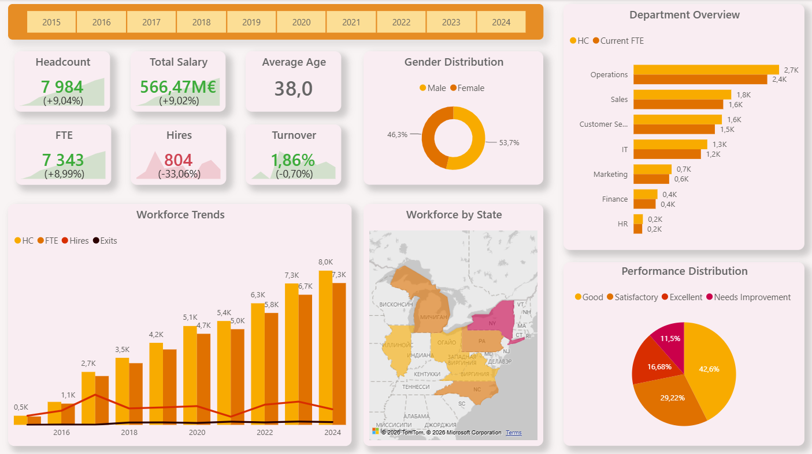
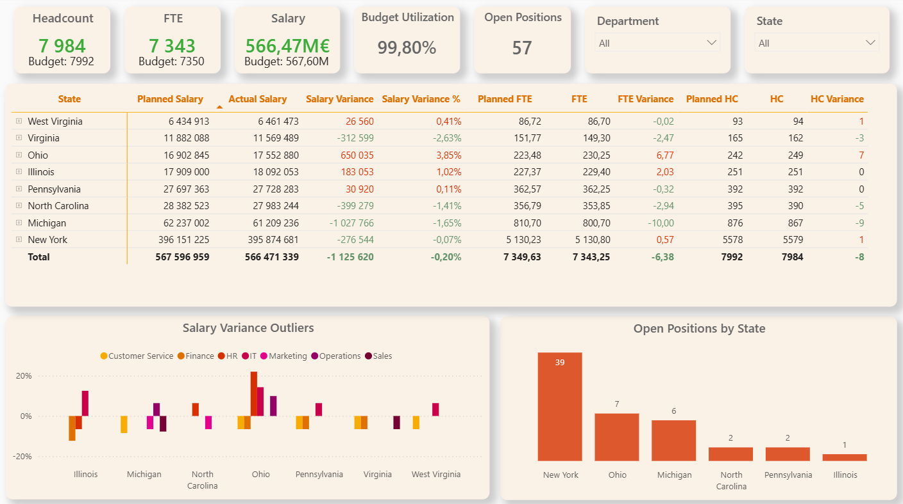

# People Analytics & HR Controlling Dashboard

## Overview

End-to-end HR analytics project built with Databricks, SQL, Power BI and DAX.

The solution covers:

- workforce trends: HC, FTE, hires, exits and turnover
- workforce structure by department, state, gender and performance
- 2024 HR controlling: planned vs actual HC, FTE and salary
- salary variance analysis
- open positions by department and state

## Data & Modeling

The source contains employee-level HR data with hire/termination dates,
department, job title, salary, location and performance information.

Because the source provides one latest employee record rather than historical
snapshots, yearly workforce snapshots were reconstructed from hire and
termination dates.

Synthetic data were added for:
- FTE
- 2024 workforce budget
- open positions

Budget values were generated using reproducible SQL logic and selectively
adjusted to create realistic planning scenarios.

## Tech Stack

- Databricks
- SQL
- Power BI
- DAX
- GitHub

## Dashboard

### Workforce Overview

### HR Controlling

## Repository Structure

- `sql/` – profiling, staging, snapshots, budget and vacancy logic
- `powerbi/` – Power BI report
- `images/` – dashboard screenshots

## Key Limitations

Historical workforce presence can be reconstructed, but historical salary,
department, performance and FTE changes are not available in the original
source.

Budget and vacancy data are synthetic and used for portfolio purposes.
